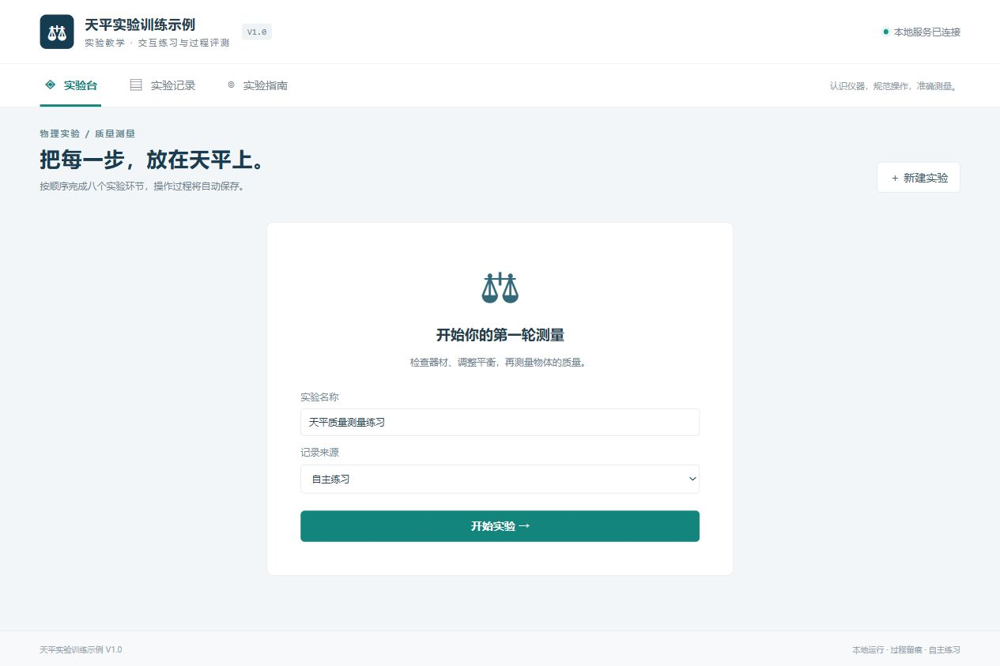

# 软著材料准备 Skill

### 让一个已经做好的软件，也拥有一套认真准备的材料。

[](.agents/skills/software-copyright-materials/SKILL.md)
[](examples/balance-lab/materials/使用说明书.pdf)
[](examples/balance-lab/README.md)
[](#几分钟开始)
[](https://github.com/handsomeZR-netizen/software-copyright-materials/releases/latest)

从真实源码出发，沿用 TeX 模板制作 PDF，把使用说明书、源程序鉴别材料、网页填写参考和完整代码一起整理好。交给 Agent 的既有工作步骤，也有模板、脚本和一份可以运行、可以对照的完整示例。

[查看使用说明书](examples/balance-lab/materials/使用说明书.pdf) · [查看源程序材料](examples/balance-lab/materials/源程序鉴别材料.pdf) · [下载发布版本](https://github.com/handsomeZR-netizen/software-copyright-materials/releases/latest)

## 为什么做这件事

软件已经能运行了，准备软著材料却常常需要重新开始一遍：梳理功能、挑选源码、截取界面、排版说明书，再把信息逐项填进网页。每一步看起来都不复杂，放在一起却很容易漏掉东西。

真正耗时间的往往是最后那些细节。目录多出一页，却只有几行内容；章节改了，目录页码没有跟着更新；说明书里的名称与申请表差了几个字；收到一份 PDF，想修改时才发现没有原稿；代码压缩包里混着旧版本，却缺少启动所需的配置。

我们希望把这些经验留在项目里。下一次准备材料时，Agent 可以沿着同一套方法读取实现、制作文档、检查一致性、整理交付。一次认真整理，也成为下一次工作的起点。

## 从实现到交付，每一份材料都有依据

这套 Skill 先读项目，再写材料。功能描述对应实际实现，操作步骤对应实际界面，源程序材料对应原始文件和行号。软件名称、版本、日期、功能与源码数量需要在文档和填写参考中相互吻合。

你最终拿到的内容分成两部分：`code.zip` 保存完整代码与运行所需文件；软件材料包呈现当前版本的材料，TeX 原稿和源码映射放在对应子目录，核验记录另行归档。再次修改时，能找到入口；准备交付时，也能看清哪些文件需要使用。

| 交付内容 | 解决什么问题 |
| --- | --- |
| 使用说明书 PDF + TeX 原稿 + 配图 | 保留统一格式，也保留继续修改的能力 |
| 源程序鉴别材料 + 文件、行号和哈希映射 | 可以追溯每段源码来自哪里 |
| 网页申请填写 Markdown | 按字段组织内容，检查必填项与字数后再填写 |
| 完整 `code.zip` | 代码、配置、依赖锁、必要资源与启动说明一起保存 |
| 模板、规范来源、脚本和复核要点 | 让后续项目能够继续沿用这套工作方法 |

## 一份完整示例，让方法看得见

仓库附带「天平实验训练示例」。你可以运行它，查看界面，再对照说明书里的章节和源码材料里的记录。Agent 也可以据此理解材料之间的关系，而不必仅凭一段抽象提示词猜测交付应该是什么样。



| 示例内容 | 当前已核验的结果 |
| --- | --- |
| 软件实现 | 可运行源码、演示数据、14 项应用测试 |
| 界面材料 | 7 张从匿名软件实际运行中采集的截图 |
| 使用说明书 | 14 页 PDF，附 TeX 和配图；目录为一页 |
| 源程序材料 | 55 页 PDF，来自 2,756 个非空源码行，附映射和哈希 |
| 制作工具 | 8 项 Python 工具测试，附构建配置与网页字段示例 |

这些数字描述的是仓库里的示例，不是其他项目必须达到的页数或规模。示例名称、主体、日期和记录标识均为演示值，真实申请需要替换为实际项目事实。

[进入完整示例](examples/balance-lab/README.md) · [浏览源码](examples/balance-lab/code) · [浏览材料](examples/balance-lab/materials)

## 为什么选择这条路径

手工整理、套用模板和直接让模型写文档，都有适合它们的场景。我们选择把真实项目、可编辑模板与核验脚本接在一起，因为准备材料不仅需要写得完整，也需要改得动、查得到。

| 方法 | 适合的场景 | 这套 Skill 补上的部分 |
| --- | --- | --- |
| 手工复制与排版 | 熟悉流程、一次性制作 | 把重复步骤和复核要点存下来，减少下一次重新摸索 |
| 只提供文档模板 | 项目内容已经整理清楚 | 从实际代码和界面补齐内容依据，并检查跨文件一致性 |
| 直接让模型生成说明书 | 快速组织初稿 | 约束功能描述，保留源码追溯、编译检查与人工复核 |
| 只交付最终 PDF | 只需要阅读当前版本 | 同时保存 TeX、配图、配置和脚本，方便后续修改 |

选择 TeX，是为了把版式留成可以重复使用的规则。标题、页眉页脚、目录和源码排版沿用模板；项目变化时，修改内容并重新编译。原稿与 PDF 一起交付，版式也就成为项目资产的一部分。

## 一些很小、却值得认真做的设计

**目录紧凑，页码也要可信。** 示例把目录压缩到一页，调整只作用于目录局部。编译会持续到交叉引用稳定，再核对目录显示页码与实际目标页，避免“目录看起来好了，页码仍是上一版”。

**源码行数可以追溯。** 长行因排版折行，仍按原始行计数。保留原有注释和许可，记录文件顺序、原始行号及 SHA-256，让源码材料能够回到项目中核对。

**已有内容值得保留。** 初始化工具遇到已有说明书会拒绝覆盖；填写参考优先更新已有 Markdown。修改围绕同一份原稿进行，减少文件夹里出现多个难以辨认的“最终版”。

**网页限字也进入流程。** 短字段、主要功能、技术特点和源程序量都有校验入口。字段限制保留观察来源，并在实际申请时复核；不把某次网页截图当作永远不变的规则。

**文件少一点，交付清楚一点。** 完整代码单独打包，当前材料集中呈现，历史版本与核验过程归档。打包后再检查 ZIP 完整性和文件哈希，避免文档更新了，交付包仍留着旧文件。

**匿名示例也认真重做。** 公开示例从匿名软件重新采集截图、重新生成 PDF，并清理身份与时间元数据。保留完整操作过程与材料之间的联系，方便新项目参考；公开托管账号本身仍然可见。

## 几分钟开始

克隆仓库后，在 PowerShell 中安装到你的项目：

```powershell
git clone https://github.com/handsomeZR-netizen/software-copyright-materials.git
cd software-copyright-materials
.\scripts\install.ps1 -ProjectRoot '你的项目目录'
```

安装位置为项目的 `.agents/skills/software-copyright-materials`，同时带上完整匿名示例。已有同名 Skill 时，先检查现有内容，再使用 `-Force` 更新；使用 `-Personal` 可安装到个人 skills 目录。

在 Codex 新会话中调用：

```text
使用 $software-copyright-materials 为我的新项目准备软著源码材料、TeX说明书和网页申请填写参考，并整理成code.zip和软件材料包。
```

提供项目路径、实际软件名称、版本、权利主体及已知日期。如果已有说明书模板或历史材料，也一并提供。Agent 会从实际实现开始，完成材料后复核；未知身份、权属及发表事项保留待补，不自动提交申请。

## 想了解它如何工作

可以从 [Skill 入口](.agents/skills/software-copyright-materials/SKILL.md) 开始，也可以按当前任务阅读：

- [材料制作与复核](.agents/skills/software-copyright-materials/references/materials-workflow.md)：模板、制作流程、规范来源与复核方法。
- [网页字段规则](.agents/skills/software-copyright-materials/references/web-form.md)：申请字段、限字和填写参考的维护方式。
- [文件整理规则](.agents/skills/software-copyright-materials/references/delivery-layout.md)：代码包、当前材料与历史归档如何组织。
- [完整示例配置](examples/balance-lab/config.json)：源文件与制作参数如何连接起来。

<details>
<summary>运行示例与重建材料</summary>

运行软件示例需要 Node.js 22.18 及以上。在 `examples/balance-lab/code` 中执行 `npm ci`、`npm test`、`npm run build`、`npm start`，然后访问 `http://localhost:3187`。数据为演示记录，正常运行不需要在线业务接口。

命令行重建 PDF 需要 Python 3.10+、PyMuPDF、Pillow 和已有 XeLaTeX。当前模板使用 Windows 中文字体，其他系统需要替换字体并重新核验。内置 TeX 编辑器及编译器可用时优先使用，无需安装额外编辑器插件；命令行脚本用于批量制作及备用编译。

在仓库根目录执行：

```powershell
python -m pip install -r .agents/skills/software-copyright-materials/scripts/requirements.txt
python .agents/skills/software-copyright-materials/scripts/materials.py build --config examples/balance-lab/config.json
python .agents/skills/software-copyright-materials/scripts/check_web_form.py --input examples/balance-lab/web-form.json
python -m unittest discover -s .agents/skills/software-copyright-materials/scripts -p 'test_*.py' -v
```

路径按配置文件所在位置解析，不依赖调用时的工作目录。修改 PDF 后，还需要检查受影响页面并重新打包；机器核验与目视复核一起完成。

</details>

## 使用边界

公开仓库包含匿名项目源码和材料，不包含原姓名、原项目标识、真实申请日期、个人电脑路径、原记录编号、签名、身份证件或凭据。Git 提交使用匿名作者。示例主体、日期和权属不能直接用于真实申请。

Skill 提供材料制作与技术复核方法，不代替身份权属确认、登记机构审查，也不保证获证。正式申请时应核对当前官方要求与网页字段；已有 AI 辅助事实须如实保留。

本仓库公开展示源代码与材料，不在此额外授予项目源码的商业使用、再许可或转让权。第三方组件和字体遵守各自随附许可。
